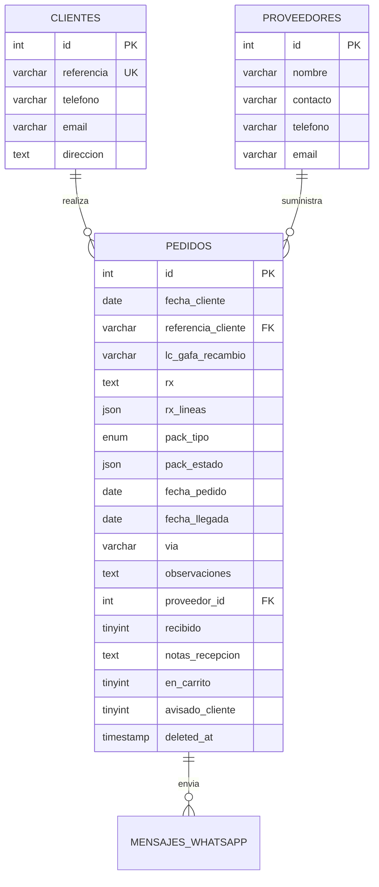

# Arquitectura de Base de Datos

El sistema utiliza **MySQL** como motor de base de datos. Existen dos bases de datos diferenciadas:
- **`u373487989_maldeojo`**: Producción.
- **`u373487989_maldeojotest`**: Entorno de Pruebas.

---

## 1. Esquema de Tablas - Módulo Pedidos

Este módulo almacena la operativa diaria de encargos de clientes a proveedores.



### Tabla `clientes`
Almacena el maestro de clientes de la óptica.
- **`id`** (INT, PK): Identificador único interno.
- **`referencia`** (VARCHAR(255), UNIQUE): Nombre identificativo corto del cliente (ej. *Marta Diaz*). Se usa como enlace lógico con los pedidos.
- **`telefono`** (VARCHAR(50)): Teléfono móvil (usado para notificaciones WhatsApp).
- **`email`** (VARCHAR(150)): Dirección de correo.
- **`direccion`** (TEXT): Dirección postal para recambios o envíos.

### Tabla `proveedores`
Maestro de laboratorios y proveedores de óptica.
- **`id`** (INT, PK): Identificador único.
- **`nombre`** (VARCHAR(255)): Nombre comercial (ej. *Alcon*, *Essilor*).
- **`contacto`** (VARCHAR(255)): Persona de contacto comercial.
- **`telefono`** (VARCHAR(50)): Teléfono de pedidos/soporte.
- **`email`** (VARCHAR(150)): Email para envío de pedidos en formato digital.

### Tabla `pedidos`
Tabla central donde se realiza el seguimiento físico y de estado de cada encargo.
- **`referencia_cliente`** (VARCHAR(255)): Relación lógica (no FK estricta para evitar bloqueos) con `clientes.referencia`.
- **`proveedor_id`** (INT, NULL): FK física a `proveedores.id`.
- **`rx`** (TEXT, NULL): Graduación clásica escrita en texto libre (formato legacy).
- **`rx_lineas`** (JSON, NULL): Graduaciones estructuradas unificadas. Almacena un array de líneas con formato:
  ```json
  [
    {
      "tipo_empaque": "blister", // 'blister' o 'caja'
      "ojo": "derecho", // 'derecho', 'izquierdo' o 'ambos'
      "esf": "-1.25",
      "cil": "-0.50",
      "eje": "90",
      "add": "+1.50"
    }
  ]
  ```
- **`pack_tipo`** (ENUM('cajas', 'blisters', 'ambos'), NULL): Clasificación técnica del pedido de lentillas.
- **`pack_estado`** (JSON, NULL): Control de inventario de packs recibidos parcialmente. Ejemplo:
  ```json
  {
    "cajas": { "pedidas": 4, "recibidas": 2 },
    "blisters": { "pedidas": 12, "recibidas": 0 }
  }
  ```
- **`recibido`** (TINYINT): Estado del pedido (0 = Pendiente/Por pedir/En camino, 1 = Recibido completo, 2 = Recibido parcial, 3 = Cancelado).
- **`deleted_at`** (TIMESTAMP, NULL): Marca de borrado lógico.

---

## 2. Esquema de Tablas - Módulo Facturas Check

Módulo en React + Vite que audita los precios cobrados por los proveedores contra las tarifas cargadas.

### Tabla `facturas_product_families`
Define la agrupación comercial superior (familias) de productos ópticos.
- **`id`** (VARCHAR(100), PK): UUID o slug generado.
- **`family_name`** (VARCHAR(255), UNIQUE): Nombre de la familia (ej. *Dailies Total 1*).
- **`base_price`** (DECIMAL(10, 2)): Precio base de tarifa para la familia.
- **`regex_pattern`** (TEXT): Patrón de expresión regular usado por el parser local para emparejar el texto OCR de la factura con esta familia.
- **`product_type`** (ENUM('lens', 'frame', 'accessory', 'solution', 'other')): Tipo de producto.
- **`provider`** (VARCHAR(255)): Nombre del proveedor asociado.

### Tabla `facturas_products`
Catálogo de productos individuales (graduaciones o SKUs específicos).
- **`id`** (VARCHAR(100), PK): UUID.
- **`sku`** (VARCHAR(100), UNIQUE): Código único de barras o referencia de catálogo del proveedor.
- **`name`** (VARCHAR(255)): Nombre completo del producto.
- **`family_id`** (VARCHAR(100), FK): Enlace a `facturas_product_families.id`.
- **`expected_price`** (DECIMAL(10, 2)): Precio neto esperado tras aplicar descuentos negociados.
- **`vat`** (DECIMAL(5, 2)): Porcentaje de IVA aplicable (normalmente 10% o 21%).

### Tabla `facturas_audits`
Cabecera y resultados de la auditoría de cada PDF subido.
- **`id`** (VARCHAR(100), PK): UUID.
- **`invoice_date`** (DATE): Fecha de emisión de la factura física.
- **`provider`** (VARCHAR(255)): Nombre del proveedor extraído.
- **`invoice_number`** (VARCHAR(100)): Código identificativo de la factura.
- **`invoice_subtotal`** (DECIMAL(10,2)): Base imponible total.
- **`tax_total`** (DECIMAL(10,2)): Suma de los impuestos (IVA).
- **`total_invoice`** (DECIMAL(10,2)): Total de la factura facturado (debe cuadrar con subtotal + IVA).
- **`global_status`** (ENUM('pending', 'approved', 'rejected', 'in_review')): Estado de la revisión humana.
- **`lines`** (JSON): Array de líneas leídas por el parser o Gemini:
  ```json
  [
    {
      "sku": "12345",
      "name": "Dailies Total 1 (90 uds)",
      "qty": 2,
      "price": 45.50,
      "discount": 10.00,
      "total": 81.90,
      "vat": 10.00
    }
  ]
  ```
- **`pdf_path`** (VARCHAR(500)): Ruta física del archivo PDF en el servidor.
- **`ocr_text`** (TEXT): Capa de texto completa recuperada del PDF.

### Tabla `facturas_pages`
Evidencia visual de las páginas de la factura para alimentar el Asistente IA.
- **`id`** (VARCHAR(100), PK).
- **`audit_id`** (VARCHAR(100), FK): Enlace a `facturas_audits.id`.
- **`page_number`** (INT): Número de página (1-indexada).
- **`image_path`** (VARCHAR(500)): Ruta local a la imagen renderizada JPEG de esa página.

### Tabla `facturas_alerts`
Alertas generadas por discrepancias de precios o anomalías de IVA.
- **`alert_type`** (ENUM('unknown_product', 'price_change', 'price_error', 'vat_error')).
- **`severity`** (ENUM('info', 'warning', 'critical')).
- **`expected_value`** / **`actual_value`** / **`difference`**: Campos numéricos de control para mostrar en la interfaz de auditoría.

---

## 3. Política de Borrado Lógico (Soft Delete)

Por seguridad operativa y para conservar el histórico intacto, **los pedidos nunca se eliminan físicamente de la base de datos**.

Al pulsar en "Eliminar", se ejecuta un borrado lógico:
```sql
UPDATE pedidos SET deleted_at = NOW() WHERE id = :id AND deleted_at IS NULL;
```

### Reglas para Consultas y Listados
Cualquier script o vista SQL que liste pedidos activos, genere métricas o busque coincidencias **debe incluir** explícitamente el filtro de exclusión de eliminados:

```sql
SELECT * FROM pedidos p 
WHERE p.deleted_at IS NULL
  AND p.recibido = 0;
```

Solo el controlador de administración **`controllers/restaurar_pedido.php`** está autorizado a consultar y limpiar el flag devolviendo `deleted_at = NULL`.
