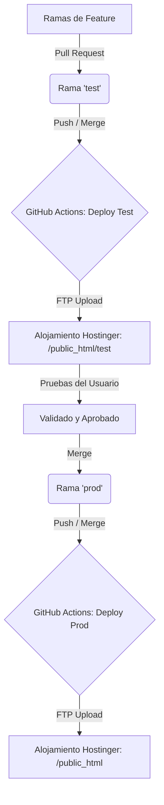

# Entornos y Despliegue

Este documento describe la infraestructura de alojamiento, el flujo de desarrollo git y la tubería de integración y despliegue continuo (CI/CD) para la plataforma **Optikamaldeojo**.

## 1. Hosting e Infraestructura

La plataforma está alojada en un servidor compartido de **Hostinger**. Debido a las limitaciones de un hosting compartido tradicional, no disponemos de acceso SSH directo en el flujo normal, por lo que el despliegue se gestiona a través de **FTP seguro** desde GitHub Actions.

Existen dos entornos completamente aislados:

### Entorno de Producción
- **URL**: `https://sienna-woodpecker-278479.hostingersite.com/` (Raíz)
- **Base de Datos**: `u373487989_maldeojo`
- **Directorio Servidor**: `/public_html`
- **Propósito**: Uso diario de la óptica para pedidos y facturas reales.

### Entorno de Test (Pruebas)
- **URL**: `https://sienna-woodpecker-278479.hostingersite.com/test/`
- **Base de Datos**: `u373487989_maldeojotest`
- **Directorio Servidor**: `/public_html/test`
- **Propósito**: Saneamiento de código, validación de nuevas características y pruebas de APIs de IA sin consumir base de datos ni créditos de producción.

---

## 2. Flujo de Git y Despliegue

El despliegue está automatizado con GitHub Actions. Las ramas principales disparan despliegues inmediatos a sus respectivos entornos.



### Ramas principales
- **`test`**: Sincronizada con el entorno de pruebas. Cualquier commit en esta rama activa el flujo `.github/workflows/deploy-test.yml`.
- **`prod`**: Sincronizada con el entorno de producción. Cualquier commit en esta rama activa el flujo `.github/workflows/deploy-prod.yml`.

---

## 3. Secretos de GitHub

Para que GitHub Actions pueda compilar y subir los archivos a Hostinger, se configuran los siguientes secretos en el repositorio:

| Secreto | Tipo / Valor | Propósito |
|---------|--------------|-----------|
| `HOSTINGER_FTP_HOST` | FTP Host | IP o dominio del servidor FTP de Hostinger. |
| `HOSTINGER_FTP_USER` | FTP User | Usuario del FTP. |
| `HOSTINGER_FTP_PASSWORD` | String | Contraseña del FTP. |
| `HOSTINGER_TEST_DIR` | Ruta | Directorio destino para Test (normalmente `/public_html/test`). |
| `HOSTINGER_PROD_DIR` | Ruta | Directorio destino para Prod (normalmente `/public_html`). |
| `TEST_DB_USER` | String | Usuario de la Base de Datos `u373487989_maldeojotest`. |
| `TEST_DB_PASS` | String | Contraseña de la Base de Datos `u373487989_maldeojotest`. |
| `PROD_DB_USER` | String | Usuario de la Base de Datos `u373487989_maldeojo`. |
| `PROD_DB_PASS` | String | Contraseña de la Base de Datos `u373487989_maldeojo`. |
| `GEMINI_API_KEY` | API Key | Clave de acceso a la API de Gemini para la extracción y chat de Facturas. |

---

## 4. Funcionamiento del Despliegue Incremental

Para optimizar el tiempo de subida en el hosting compartido (el FTP puede ser lento y fallar con archivos grandes), el flujo de GitHub Actions implementa un **despliegue incremental**:

1. **Compilación de React**: Instala las dependencias en `facturas-src/` y compila la aplicación a la carpeta `facturas/`.
2. **Generación de db_config.php**: Escribe el archivo `includes/db_config.php` dinámicamente en el build de lanzamiento con los datos del servidor y la clave de Gemini correspondientes al entorno.
3. **Detección de Cambios**: Obtiene el listado de archivos modificados mediante `git diff --name-only $BEFORE_SHA $GITHUB_SHA`.
4. **Subida Selectiva**: Solo copia e incrementa por FTP los archivos modificados bajo las rutas permitidas (ej: `pedidos/`, `includes/`, `assets/`, `facturas/`).
   
> [!WARNING]
> Si una subida falla a mitad por FTP debido a caídas puntuales del servidor, el despliegue del commit quedará marcado en GitHub como fallido. Al realizar un nuevo commit, el diff incremental podría obviar los archivos que no se subieron en el intento fallido anterior. En estos casos, se puede ejecutar una ejecución manual (`workflow_dispatch`) desde la pestaña "Actions" de GitHub para forzar una subida **completa** y limpia.

---

## 5. Configuración de Base de Datos y Credenciales

El archivo `includes/db_config.php` contiene la configuración de conexión de la base de datos MySQL y la API Key de Gemini:

```php
<?php
define('DB_HOST',    'localhost');
define('DB_NAME',    'u373487989_maldeojotest'); // O u373487989_maldeojo
define('DB_USER',    'usuario_entorno');
define('DB_PASS',    'password_entorno');
define('DB_CHARSET', 'utf8mb4');
define('GEMINI_API_KEY', 'clave_gemini');
define('GEMINI_MODEL', 'gemini-2.5-flash');
```

> [!IMPORTANT]
> **Nunca** edites `includes/db_config.php` directamente en git, ya que está excluido en el `.gitignore` para evitar brechas de seguridad. Cualquier cambio en la estructura de credenciales debe reflejarse en los scripts de despliegue en `.github/workflows` y en `deploy/prepare_hostinger_release.sh`.

---

## 6. Despliegue Manual de Respaldo

Si necesitas generar paquetes de despliegue de forma local para subirlos manualmente mediante cPanel o un cliente FTP como FileZilla:

1. Asigna permisos al script: `chmod +x deploy/*.sh`
2. Ejecuta: `./deploy/build_hostinger_packages.sh`
3. Esto generará dos archivos ZIP en `deploy/dist/`:
   - `optikamaldeojo-test-upload.zip`
   - `optikamaldeojo-prod-upload.zip`
4. Descomprime el ZIP correspondiente en el directorio adecuado del servidor.
