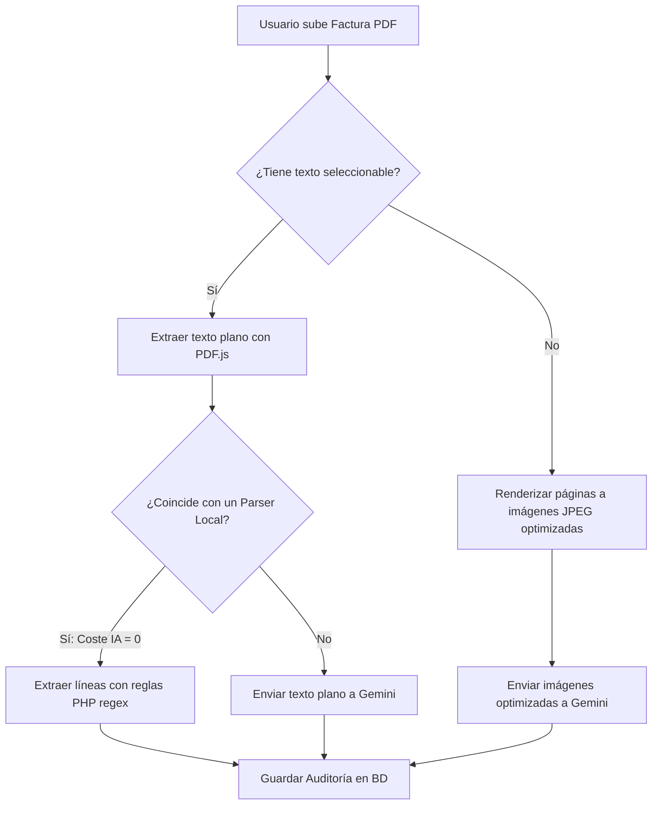

# Módulo de Facturas Check

El módulo **Facturas Check** es un sistema híbrido diseñado para auditar las facturas emitidas por los proveedores de la óptica, controlando las discrepancias de precios y discrepancias de IVA.

---

## 1. Arquitectura Técnica

El módulo está estructurado en dos partes:

```text
OptikamaldeojoPlatform/
├── facturas-src/          # Frontend en React + Vite + TypeScript (Código Fuente)
├── facturas/              # Carpeta de producción (React compilado en JS/HTML estático)
└── pedidos/api/facturas.php # Backend API unificado en PHP (Procesa BD e IA)
```

- **Frontend**: Una Single Page Application (SPA) construida en React. Utiliza `PDF.js` de forma asíncrona para renderizar y leer los documentos en el navegador del cliente.
- **Backend**: El archivo `pedidos/api/facturas.php` centraliza toda la lógica de servidor, incluyendo el acceso a la base de datos y la comunicación directa con la API de Gemini mediante solicitudes HTTP `curl`.

---

## 2. Flujo de Extracción de Datos (Ingesta)

El flujo está diseñado para minimizar el consumo de recursos e IA, priorizando las reglas de expresiones regulares y parseo local.



### Fase 1: Lectura del PDF en el Navegador
1. El usuario selecciona un archivo PDF.
2. El frontend utiliza `PDF.js` para intentar leer el texto plano indexado en el archivo página por página.
3. Si el PDF es un escaneo (no tiene capa de texto), el frontend renderiza las primeras páginas del documento como imágenes JPEG optimizadas (a escala reducida y compresión de calidad media) para evitar saturar el ancho de banda y la memoria de Gemini.

### Fase 2: Parseo en Servidor (API PHP)
El servidor recibe el texto o las imágenes optimizadas y decide cómo procesarlas:

#### A. Parser Local (Expresiones Regulares)
Si se encuentra una plantilla local de expresiones regulares mapeada para el proveedor en `pedidos/includes/invoice_text_parser.php`:
- El servidor ejecuta funciones nativas PHP para trocear el texto plano y emparejar los SKU, nombres de producto, cantidades y precios.
- **Coste de IA**: **0 créditos**. Es instantáneo y 100% preciso.

#### B. Respaldo de Inteligencia Artificial (Gemini)
Si no hay capa de texto utilizable o el formato de la factura no coincide con ningún parser local conocido:
- El servidor realiza una consulta a la API de Gemini (modelo por defecto: `gemini-2.5-flash`) adjuntando el texto o las imágenes JPEG y un *System Prompt* muy estricto que exige una respuesta en formato JSON estructurado.
- El modelo devuelve las líneas de factura extraídas mapeadas.

---

## 3. Reglas de Validación Fiscal y de Negocio

Una vez leídas las líneas, el sistema las procesa bajo las siguientes directrices:

- **Precio de Tarifa vs. Importe Facturado**: En facturas con columnas `PRECIO TARIFA`, `DESCUENTO (%)` e `IMPORTE`, la auditoría debe contrastar y calcular la base imponible a partir del **IMPORTE final** (neto cobrado) y no del precio de catálogo. El precio de catálogo se almacena solo como referencia para comparar con el histórico de tarifas.
- **Conciliación de Impuestos**: El total de la factura debe cuadrar de forma matemática exacta:
  $$\text{Total Factura} = \text{Subtotal (Base Imponible)} + \text{Cuotas de IVA}$$
  No se asumen totales automáticos a menos que el parser local o la IA hayan leído y cuadrado con éxito el resumen fiscal del pie del documento.
- **Exclusión de Importes Cero / Conceptos No Comerciales**: El proceso de auditoría ignora cargos de embalaje, importes de envío o bonificaciones con precio final cero para no ensuciar el catálogo de productos con datos basura.

---

## 4. Control de Costes de la IA

Para evitar facturas de API elevadas o bloqueos de cuota, el sistema implementa:
1. **Configuración de Respaldo por Defecto**: Las auditorías se configuran por defecto como `0 páginas · Sin IA`. Gemini solo entra en juego si el usuario activa manualmente el respaldo de IA (modo "Normal" o "Flash-Lite") ante facturas difíciles o de proveedores nuevos.
2. **Imágenes Optimizadas**: En lugar de enviar PDFs gigantes, la conversión a JPEG a baja resolución en el cliente mantiene el peso de la petición por debajo de los 200KB por página.
3. **Parámetros Estrictos**:
   - `temperature = 0` para asegurar respuestas deterministas y evitar invenciones del modelo.
   - `maxOutputTokens` acotado para recibir solo el JSON estructurado esperado.
