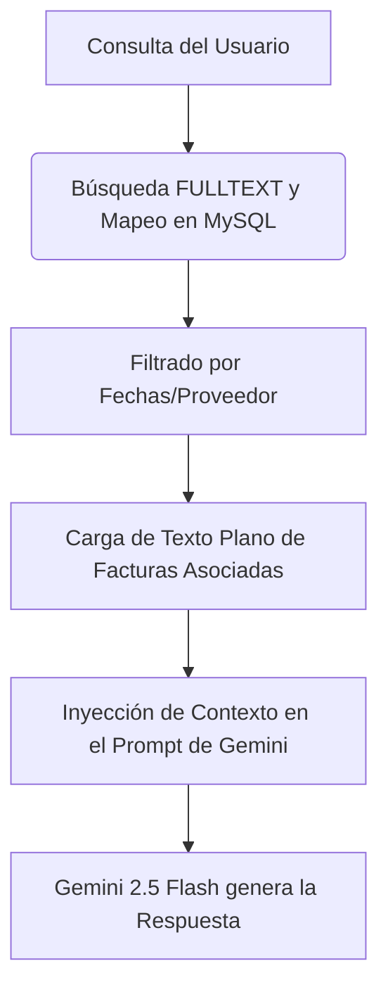

# Asistente RAG e Inteligencia Artificial

El módulo de Facturas Check incluye un **Asistente IA** (chat interactivo) para que los encargados y administradores puedan consultar dudas sobre precios históricos, discrepancias de facturación o detalles de auditorías anteriores.

---

## 1. Arquitectura de Búsqueda Híbrida (Estado Actual)

En lugar de utilizar una infraestructura de RAG (Generación Aumentada por Recuperación) compleja que requeriría bases de datos vectoriales dedicadas (las cuales consumen muchos recursos en un hosting compartido), el asistente utiliza un sistema de **recuperación híbrida basado en MySQL**:

### Recuperación de Contexto
Cuando el usuario hace una pregunta al asistente (ej. *"¿Cuánto nos cobró Essilor por la lentilla Dailies en la última factura?"*):
1. **Mapeo por palabras clave**: La API ejecuta búsquedas en la tabla `facturas_audits` (usando índices `FULLTEXT` en los campos de texto OCR y de metadatos) y en la tabla `facturas_products` para identificar qué registros y qué líneas coinciden con los términos de la pregunta.
2. **Historial de Precios**: El backend extrae el histórico relevante desde la tabla `facturas_price_history` para el SKU o familia detectada.
3. **Generación de Contexto**: La API concatena esta información estructurada y la envía como contexto adjunto a Gemini junto a la pregunta del usuario.

---

## 2. Evidencia y Fuentes Visuales

Para mejorar la confiabilidad de las auditorías y dar soporte visual al asistente:
- El frontend renderiza las páginas de la factura como imágenes y las almacena físicamente en el servidor (tabla `facturas_pages`), limitándose hasta un **máximo de 20 páginas** por auditoría para preservar espacio de almacenamiento.
- Cuando el asistente responde sobre un dato concreto de una factura, la interfaz permite asociar e indicar la página exacta en la que se localizó el dato, cargando la imagen almacenada como evidencia visual para que el usuario pueda cotejarla.

---

## 3. Hoja de Ruta: Transición a RAG Avanzado (Embeddings)

A medida que el número de facturas y registros históricos crezca en la base de datos, la búsqueda por términos de MySQL podría volverse menos precisa frente a consultas complejas. La transición planteada para el futuro se compone de los siguientes pasos:

### Fase 1: Generación de Embeddings Locales
- En lugar de indexar texto plano, cada vez que una factura se procese con éxito, se enviará el texto extraído de cada página a la API de Embeddings de Gemini (`text-embedding-004`).
- Se almacenará el vector devuelto (una lista de números decimales de punto flotante) en una nueva columna de tipo `VECTOR` o `BLOB` en la base de datos MySQL.

### Fase 2: Búsqueda Semántica en MySQL
- Para mantener la base de datos monolítica y simplificada en el hosting compartido de Hostinger, se puede utilizar la extensión de MySQL o realizar cálculos matemáticos de **similitud del coseno** directamente en PHP sobre los vectores BLOB recuperados.
- Esto permitirá buscar facturas basándose en el *sentido* de la consulta en lugar de coincidencia exacta de letras (ej. identificar "lentillas de hidrogel" aunque en la factura solo ponga el nombre del modelo técnico).

### Fase 3: Microservicio Vectorial Dedicado
Si el volumen de facturas supera los miles de registros anuales, se recomienda externalizar la base de datos vectorial:
- Migrar el almacenamiento de embeddings a un servicio gratuito o de bajo coste como **Pinecone** o **Supabase (pgvector)**.
- Crear un microservicio intermedio ligero en Python (FastAPI) encargado de recibir la consulta, buscar los trozos de factura semánticamente más cercanos en Pinecone, y devolver las respuestas usando modelos de lenguaje acotados.
- **Importante**: Este salto técnico solo debe plantearse una vez que la base de datos local actual se encuentre bajo uso intensivo y consolidada en la tienda diaria.
